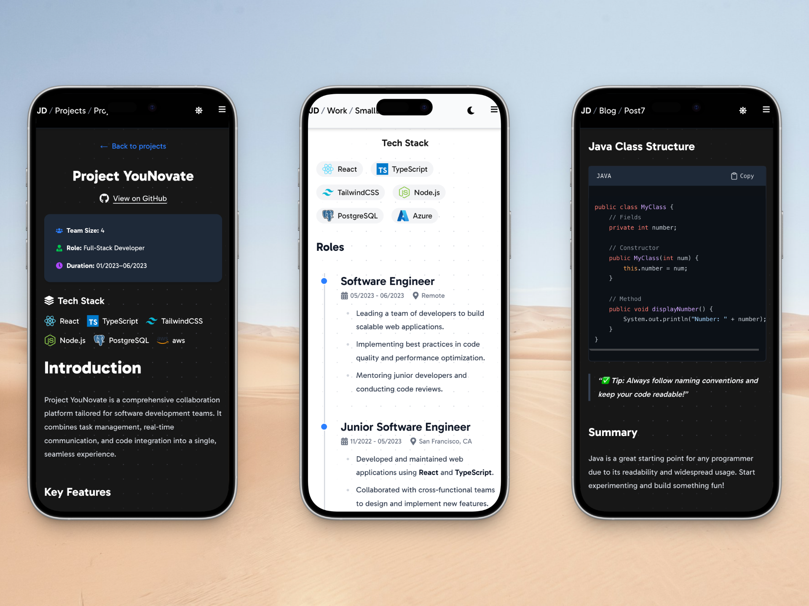

# Next.js Personal Website Theme

This is a custom personal website theme built using [Next.js](https://nextjs.org), bootstrapped with
[`create-next-app`](https://nextjs.org/docs/app/api-reference/cli/create-next-app). It’s designed as a minimal,
performance-focused starting point for showcasing your **work**, **writing**, and **projects**.

> **Note:** This theme is generally aimed at developers and designers who want to create a personal website
> quickly and easily. Yes, I'm aware there are many other templates and themes available—_you can literally find
> them all over the internet_. The personal goal of building this theme was to get familiar
> with [Next.js](https://nextjs.org), and improve skills in **React** and **TypeScript**.
> I also wanted to create a starter template for myself, since none of the existing templates met my exact design and
> functionality needs, without requiring extensive modifications. So...here we are! Feel free to use this as a starting
> point for your own personal website, or as a reference for doing the same thing I did: _building your own custom
> theme!_




---

## 🧱 Project Structure

The site is organized around the following main routes/pages:

- 🏠 **Home** – `/`
- 💼 **Work** – `/work`
- 🛠️ **Projects** – `/projects`
- ✍️ **Blog** – `/blog`

Each page is intentionally _simple_ and _clean_, making it easy to customize and build upon.

---

## 🚀 Getting Started

To start your development environment locally, after cloning the repository, run one of the following commands
in the root directory of the project:

```bash
npm run dev
# or
yarn dev
# or
pnpm dev
# or
bun dev
```

Once the server is running, open [http://localhost:3000](http://localhost:3000) in your browser to view the
homepage.

---

## 🧭 Roadmap

Planned improvements and current/future features:

- [X] 🖥️ Create pages for:
    - [X] Home
    - [X] Work
    - [X] Projects
    - [X] Blog
- [X] 📺 Add UI components/elements for:
    - [X] Header with navigation
    - [X] Footer
    - [X] Home page with a hero section
- [X] 📄 Enable MDX for:
    - [X] Individual Work pages
    - [X] Blog post pages
    - [X] Project detail pages
- [X] 👨🏻‍💻 MDX Syntax Highlighting for code blocks
- [X] 🌙 Add light/dark mode support
- [X] 🖼️ Add a Carousel component to display images/highlights for work/projects/blog posts
- [X] 🔍 Improve content structure, accessibility, and SEO
- [ ] 🧪 Add tests and linting support for better maintainability
- [ ] ❔ Add guides (i.e., READMEs) for creating blog/project/work pages
- [X] 🔢 Add sorting/filtering functionality for:
    - [X] Work items
    - [X] Projects
    - [X] Blog posts
- [ ] 🖼 Add theme customization options:
    - [ ] Color palette
    - [ ] Layout options
- [X] 📄 Add recommended similar blog posts items to the bottom of each blog post
- [ ] 📄 Add blog post categories pages
- [X] 📄 Add pagination to blog posts

---

## 📚 Learn More

Want to dig deeper into `Next.js`, or other resources, and see how this theme works?

- [📘 Next.js Documentation](https://nextjs.org/docs) – Core concepts and API
- [🎓 Learn Next.js](https://nextjs.org/learn) – Interactive tutorial
- [🔗 GitHub – Next.js](https://github.com/nextjs) – Source code and community discussion
- [📖 React Documentation](https://reactjs.org/docs/getting-started.html) – Learn React
- [🌎 MDN Web Docs](https://developer.mozilla.org/en-US/) – Comprehensive web development resources

---

## ▲ Deployment

The fastest way to deploy this app is
via [Vercel](https://vercel.com/new?utm_medium=default-template&filter=next.js&utm_source=create-next-app&utm_campaign=create-next-app-readme) —
the platform made by the creators of Next.js.

For more detailed instructions, check out
the [Next.js deployment guide](https://nextjs.org/docs/app/building-your-application/deploying).

> **Note:** This does not mean you _have_ to use Vercel. You can deploy this app on any platform that supports
> Node.js, such as [Netlify](https://www.netlify.com), [Render](https://render.com),
> [AWS Amplify](https://aws.amazon.com/amplify/), or much more. Even [GitHub Pages](https://pages.github.com/) is
> a viable option, but it requires the use of a static export,
> see [Next.js docs for that](https://nextjs.org/docs/app/getting-started/deploying#static-export).

---

## 🛠 Tech Stack

This project uses:

- ⚛️ [Next.js](https://nextjs.org) – React-based framework
- 💅 [Tailwind CSS](https://tailwindcss.com) - Utility-first CSS framework
- 🧱 [TypeScript](https://www.typescriptlang.org) – Static typing

---

## 💬 Feedback & Contributions

Got suggestions, issues, or ideas for improvement? Feel free to open an issue or submit a pull request — contributions
are always welcome!
